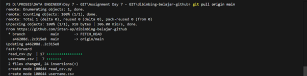

# dibimbing-belajar-github

1.	Buatlah satu repository Github dengan nama dibimbing-belajar-github.

    a.	Klik tombol New untuk membuat repository baru
        
    b.	Isi nama repository dengan dibimbing-belajar-github
    
    c.	Centang opsi Initialize this repository with a README
    
    d.	Klik tombol Create repository
        

2.	Clone repository tersebut ke local laptop/working directory yang sudah kita siapkan.
    
    a.	Salin URL repository yang baru dibuat dari GitHub
        
    b.	Buka VS Code. Sebelum menjalankan perintah git clone, pindahkan terminal ke direktori target
        
    
    
    c.	Setelah berada di direktori yang sesuai, jalankan perintah git clone
    
    
    
    d.	Masuk ke direktori yang sudah ter-clone
        
    

3.	Buatlah satu file python yang berisi tentang function untuk read file csv.
    
    a.	Klik File > Open Folder
        
    
    
    b.	Pilih folder yang ingin menyimpan file Python, misalnya folder tempat file CSV berada
    
    c.	Klik Select Folder untuk membuka folder tersebut di VS Code
        
    d.	Klik ikon New File
    
    
    
    e.	Simpan file baru dengan nama read_csv.py
    
    
    f.	Setelah file dibuat, bisa mulai menulis kode Python di dalamnya
    
    
    
    g.	Jalankan file Python di terminal VS Code
    
    

4.	Membuat branch dengan format feature/read_csv_function.
    

5.	Commit semua file ke feature/ read_csv_function, lalu push ke repository

    a.	Tambahkan semua file ke stage
    
    
    
    b.	Commit perubahan
    
    
    
    c.	Push ke branch yang baru dibuat
    
    

6.	Lalu, buatlah Pull Request di Github untuk merge ke branch master/main

    a.	Masuk ke repository GitHub
    
    b.	Akan ada notifikasi tentang branch baru yang baru saja di-push
    
    c.	Klik tombol Compare & pull request
        
    d.	Klik Create pull request
        

7.	Yang terakhir lakukan Pull remote master/main branch ke local master/main branch
    
    a.	Klik merge pull request
        
    b.	Setelah Pull Request di-merge ke branch master/main, kembali ke terminal lokal
    
    c.	Pindah ke branch master/main
    
    
    
    d.	Pull branch master/main ke lokal
    
    
